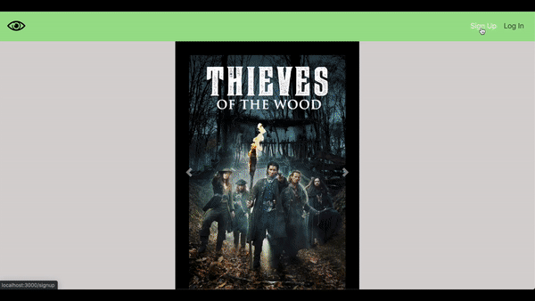
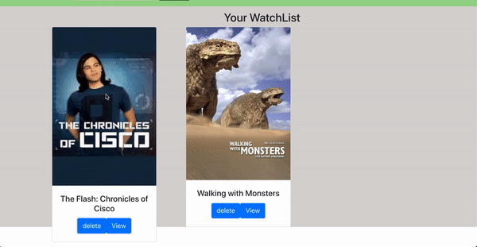

# Show-Tracker - App 📺

[Backend](https://github.com/DannyBrito/show-tracker-backend)

> A tracking app that helps you keep better track of your tv-show activity. 


## Overview

Users can add & remove tv shows from their watchlist.
The search bar can be easily accessed by users to look up different tv shows. Once the results are displayed, the user has two options:

<li/>track tv-show
<li/>go to display page for specific tv-show
#


<b>Sign Up & Log In:</b>

Standard Log-In and Sign-Up pages implemented with different validations and Auth0.




<b>JWT/Auth0 & LocalStorage:</b>

Utilized JWT, Auth0, and LocalStorage to allow users to stay log-in, improving user experience.



## Technologies
<ul>
<li /><b>React</b>
<li /><b>JavaScript</b>
<li /><b>HTML/CSS</b>
<li /><b>JWT & Auth0</b>
<li />Ruby on Rails - API
<li />Bcrypt
<li />Postgresql
<li />The Movie DB API - tv-shows Data
</ul>


### Getting Started
These instructions will get you a copy of the project up and running on your local machine for development and testing purposes.
##### Prerequisites
<ul>
<li /> NPM
<li /> Ruby
<li /> Postgresql
<li /> The Movie DB API Key
</ul> 

##### Running

0. Set up [Backend Server](https://github.com/DannyBrito/show-tracker-backend)
1. Clone/Download Repo.
2. move into project ``` cd tv-show-tracker-client```
3. install dependencies
    ```sh 
    npm i
    ```
4. run client with npm start
    ```sh 
    npm start
    ```

## features to implement 

<ul>
<li />social interaction between users
<li />individual episode tracking
<li />creating multiple watch-lists
</ul>

## Meta

Danny Brito – [LinkedIn](https://www.linkedin.com/in/dannybrito) - [Github](https://github.com/DannyBrito)
